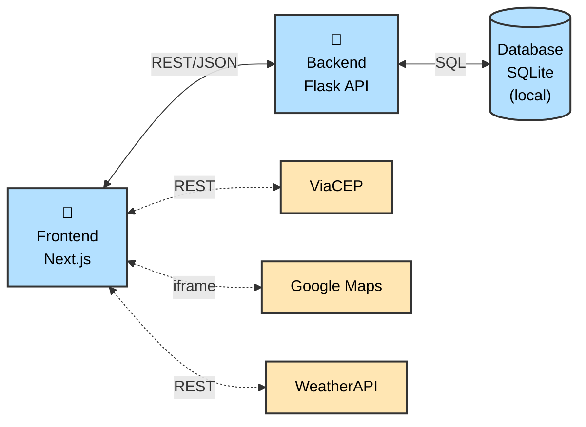

# Venha v2 - Backend (Flask)

API REST para o sistema de convites online Venha, permitindo criação e gerenciamento de eventos com funcionalidade de RSVP.

> **Nota:** Esta é a versão 2 (v2) do Venha, com arquitetura simplificada. A versão original está disponível em [rsvp_app_api](https://github.com/FernandaFranco/rsvp_app_api).

## 📋 Sobre o Projeto

O sistema Venha permite que anfitriões criem eventos e gerem um link de convite para compartilhar, e assim gerenciar confirmações de presença. Os convidados podem confirmar presença, modificar ou cancelar suas respostas através desse link.

### Funcionalidades Principais

**Para Anfitriões:**

- Cadastro e autenticação de usuário
- Criação de eventos com data, hora e endereço (via CEP)
- Visualização de lista de eventos criados
- Gerenciamento de convidados confirmados
- Recebimento de emails simulados quando alguém confirma presença
- Exportação de lista de convidados em CSV
- Configuração de permissões (permitir/bloquear modificações e cancelamentos)

**Para Convidados:**

- Visualização de detalhes do evento via link
- Confirmação de presença (RSVP)
- Informação de número de adultos e crianças
- Comentários sobre necessidades especiais ou alergias
- Modificação de confirmação de presença
- Cancelamento de presença com motivo opcional

## 🏗️ Arquitetura da Aplicação

<details>
<summary>💡 Ver diagrama de arquitetura (clique para expandir)</summary>



</details>

**Legenda:**

- **Linha contínua (←→):** Comunicação obrigatória
- **Linha tracejada (←-→):** Comunicação opcional
- **🐳 (Docker):** Container Docker separado
- **Azul:** Módulos implementados no projeto
- **Amarelo:** APIs externas

**Componentes:**

- **Frontend (Next.js) 🐳:** Interface web responsiva, páginas públicas e privadas, autenticação via session cookies
- **Backend (Flask) 🐳:** API REST com lógica de negócio, validações, documentação Swagger automática
- **Database (SQLite):** Arquivo local montado via volume Docker para persistência de dados (hosts, eventos e RSVPs)
- **APIs Externas:** ViaCEP (endereços), Google Maps (mapas via iframe), WeatherAPI (clima)
- **Notificações:** Emails simulados no console (sem envio real)

## 🛠️ Tecnologias Utilizadas

- **Python 3.x**
- **Flask** - Framework web
- **SQLAlchemy** - ORM para banco de dados
- **SQLite** - Banco de dados (desenvolvimento)
- **Flask-RESTX** - Documentação Swagger/OpenAPI
- **Bcrypt** - Hash de senhas

## 📁 Estrutura do Projeto

```
backend/
├── app.py                      # Aplicação principal com todas as rotas e documentação Swagger
├── extensions.py               # Inicialização de extensões (db, bcrypt, limiter)
├── models.py                   # Modelos do banco de dados (Host, Event, Attendee)
├── services/                   # Serviços externos
│   ├── __init__.py
│   └── email_service.py       # Simulação de emails
├── utils/                      # Utilitários
├── requirements.txt            # Dependências Python
├── .env.example               # Template de variáveis de ambiente
├── Dockerfile                 # Dockerfile do backend
└── .gitignore                 # Arquivos ignorados pelo Git
```

## 🚀 Como Rodar o Projeto (Docker)

Esta é a forma recomendada de rodar o projeto completo (frontend + backend). Este método garante que todas as dependências sejam instaladas corretamente e que ambos os serviços se comuniquem adequadamente.

### Pré-requisitos

- Docker Desktop instalado e rodando
- Git instalado
- Conexão com internet para download de dependências

### Passo 1: Clonar os Repositórios

Crie um diretório pai e clone ambos os projetos:

```bash
mkdir venha_project
cd venha_project
git clone https://github.com/FernandaFranco/venha-v2-backend.git backend
git clone https://github.com/FernandaFranco/venha-v2-frontend.git frontend
```

**Importante:** Os comandos acima clonam os repositórios nas pastas `backend` e `frontend` respectivamente, que são os nomes esperados pelo Docker Compose.

**Estrutura de diretórios esperada:**

```
venha_project/
├── backend/    (este repositório)
│   ├── app.py
│   ├── .env.example
│   ├── Dockerfile
│   └── ...
└── frontend/   (repositório do frontend)
    ├── docker-compose.yml
    ├── .env.local.example
    ├── Dockerfile
    └── ...
```

### Passo 2: Configurar Backend (.env)

Primeiro, configure o backend:

1. Navegue até a pasta do backend e copie o arquivo de exemplo:

```bash
cd backend
cp .env.example .env
```

2. Edite o arquivo `backend/.env`:

```bash
# Obrigatórias
FLASK_APP=app.py
FLASK_ENV=development
SECRET_KEY=sua-chave-secreta-aqui    # Gere com: python3 -c "import secrets; print(secrets.token_hex(32))"
DATABASE_URL=sqlite:///invitations.db

# Frontend URL
FRONTEND_URL=http://localhost:3000
```

### Passo 3: Configurar Frontend (.env.local)

Agora configure o frontend:

```bash
cd ../frontend
cp .env.local.example .env.local
```

Edite o arquivo `frontend/.env.local` e configure a chave da WeatherAPI.

Veja o README do frontend para instruções completas sobre como obter a chave de API.

### Passo 4: Rodar com Docker Compose

**IMPORTANTE:** O `docker-compose.yml` está localizado na pasta `frontend/`. Certifique-se de estar na pasta `frontend/`:

```bash
cd ../frontend  # Se ainda não estiver na pasta frontend
docker-compose up --build
```

**O que acontece:**

- O Docker baixa as imagens base necessárias
- Instala todas as dependências do backend (Python/Flask)
- Instala todas as dependências do frontend (Next.js)
- Inicia ambos os serviços
- Backend fica disponível na porta 5000
- Frontend fica disponível na porta 3000

**Primeira execução:** Pode levar alguns minutos para baixar as imagens e instalar tudo.

### Passo 5: Acessar a Aplicação

Aguarde até ver as mensagens indicando que os serviços estão prontos. Então acesse:

- **Frontend (Interface):** http://localhost:3000
- **Backend API:** http://localhost:5000 (redireciona automaticamente para a documentação Swagger)
- **Documentação Swagger:** http://localhost:5000/api/docs

## 📧 Notificações por Email - Modo Simulação

**Implementação Atual:** O sistema **não envia emails reais**. Quando um convidado confirma, modifica ou cancela presença, o backend **imprime o conteúdo do email no console**.

**Como funciona:**

- Arquivo: `services/email_service.py`
- Modo: **Sempre simulação** (logs no console)
- Eventos que geram emails simulados:
  - Novo RSVP confirmado
  - Modificação de confirmação
  - Cancelamento de presença

**Para ver os emails simulados:**

Com o Docker rodando, execute em um novo terminal:

```bash
docker-compose logs -f backend
```

Faça um RSVP no frontend e observe o log formatado:

```
================================================================================
📧 EMAIL SIMULADO - Novo RSVP para Festa de Aniversário
================================================================================
De: noreply@venha.app
Para: host@example.com
Assunto: Novo RSVP para Festa de Aniversário

[Conteúdo HTML do email...]
================================================================================
```

## 🐛 Solução de Problemas

### Erro: Porta já em uso (5000)

```bash
# Mac/Linux
lsof -ti:5000 | xargs kill -9
```

### Containers não iniciam ou erro de dependências

```bash
docker-compose down -v
docker-compose up --build --force-recreate
```

### Frontend não consegue conectar ao backend

- Verifique se `NEXT_PUBLIC_API_URL=http://localhost:5000` em `frontend/.env.local`
- Verifique se `FRONTEND_URL=http://localhost:3000` em `backend/.env`
- Certifique-se de que ambos os containers estão rodando: `docker ps`

### Banco de dados não foi criado

- O SQLite é criado automaticamente na primeira execução
- Se houver problemas, remova os volumes: `docker-compose down -v`

## 📄 Licença

Este projeto foi desenvolvido para fins educacionais.

## 👤 Autora

Fernanda Franco

PUC-Rio - Pós-Graduação em Engenharia de Software
